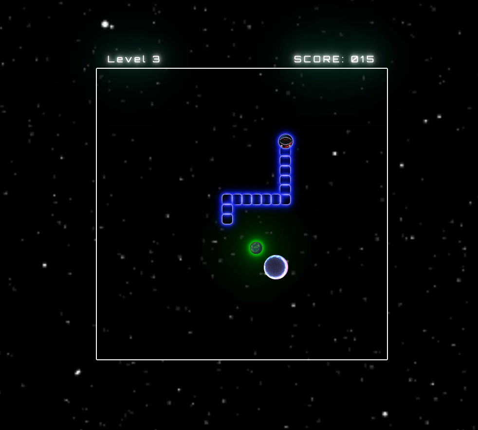

# Space-Serpents: An experiment in vanilla JS Functionality and Design
### Date: 06/29/2022
### By: James Jewitt
[Space-Serpents Trello Board]( https://trello.com/b/x3AD1vky/project-1 ) | [LinkedIn]( https://www.linkedin.com/in/james-jewitt/ ) |  [GitHub](https://github.com/jamest7783) 

***

### ***Description***
#####        For this weekend experiment, I plan to test my comprehension of vanilla JS, HTML, and CSS by building a basic "snake" game, akin to the games I remember playing on my parents' phones in the early 2000's. My goal is here to to create a simple, yet functionally sound game with minimal styling. I will know I have achieved this expectation when my JS, HTML and CSS files have all been refined to the point of having no repeat code, all functions are neat, impactful and do not perfom any unnecessary actions, and I have condensed all superfluous actions without hindering the readability of my code.

#####
#####        There are several potential issues that I expect to come across, specifically involving the logic of moving across a gameboard in all directions. Among them is the problem of moving individual 'tail elements' at different rates and on a delay. As an example, for a snake with 10 tail elements that has just recently started traveling upwards after traveling to the right would have all of its tail elements continue traveling to the right for at least a few seconds, or at least until those elements occupied the same column as the 'head' of the snake. See the second screenshot below for a visual representation of this challenge in logic. 

***

* VisualCode
* vanilla JavaScript
* HTML-5 
* CSS-3
* gfycat.com
* ezgif.com

***

### ***Screenshots***
##### Welcome to Space-Serpents

##### Attempting to achieve the angular movement of the snake

***

### ***Future Updates***
- [x] Build Game Board and Tiles
- [x] Build Snake and Snake Elements
- [X] Right Angle Movement
- [X] Acessory Functionality including Timer, Landing Page, Score Board
***

